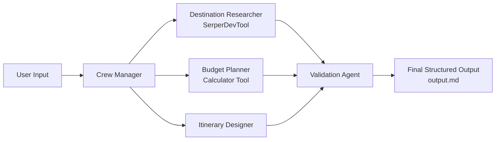

# AI Travel Planner Crew (CrewAI + Serper + Groq)

This project implements a **multi-agent AI Travel Planner** using:
- Python + CrewAI
- **Serper Dev API** for web search (mandatory)
- **Groq API** for LLM connectivity
- Custom Python **calculator tool** for budget arithmetic

## Assignment Coverage

- Multi-Agent Architecture: 4 agents
- Serper Integration: destination research agent uses `SerperDevTool`
- Task Delegation Logic: context chaining between tasks
- Budget Reasoning: category-wise estimates + calculator-based arithmetic
- Structured Output: final markdown report (`output.md`)
- Failure Handling: env checks + uncertainty/assumption requirements in prompts
- Documentation & Diagram: included below

## Agents

1. Destination Researcher
    - Uses Serper web search to gather attractions, transport notes, and practical caveats.

2. Budget Planner
    - Uses custom calculator tool to compute accommodation, food, transport, activities, and contingency.

3. Itinerary Designer
    - Builds realistic day-wise plans with no obvious schedule conflicts.

4. Validation Agent
    - Verifies consistency, feasibility, and budget alignment.
    - Produces final structured output.

## Architecture



## Project Structure

- `src/bot/config/agents.yaml`: agent roles/goals/backstories
- `src/bot/config/tasks.yaml`: task descriptions and expected outputs
- `src/bot/tools/custom_tool.py`: custom budget calculator tool
- `src/bot/crew.py`: agent + task wiring, tool assignment, context chaining, logging
- `src/bot/main.py`: runtime input parsing and crew kickoff

## Setup

1. Clone the repository:
```bash
git clone https://github.com/saidurcsesust/Travel_Planner_Crew.git
cd Travel_Planner_Crew
```

2. Install `uv` (if not already installed):
```bash
curl -LsSf https://astral.sh/uv/install.sh | sh
```

3. Create virtual environment and install dependencies:
```bash
uv sync
```

4. Configure environment variables:
Create `.env` manually with:
```bash
MODEL=groq/llama-3.3-70b-versatile 
GROQ_API_KEY=your_groq_key
SERPER_API_KEY=your_serper_key
```

## Run

Default run:
```bash
uv run crewai run
```

Run with explicit trip inputs:
```bash
uv run crewai run \
  --destination "Bali, Indonesia" \
  --travel-dates "2026-06-10 to 2026-06-14" \
  --budget 2000 \
  --currency USD \
  --preferences "beaches, local food, temples, low-cost activities"
```


## Input and Output

### Example Input

- Destination: Bali, Indonesia
- Travel Dates: 2026-06-10 to 2026-06-14
- Budget: 2000 USD
- Preferences: beaches, local food, temples, low-cost activities

### Output Files

- Final plan: `output.md`
- Execution log: `logs/execution.log`

Final plan format:
- `Travel Plan: <Destination>`
- `Destination Overview`
- `Budget Breakdown`
- `Day-wise Itinerary`
- `Validation Summary` (budget status, assumptions, risk factors)

## Mandatory Analysis

### Why multi-agent?
- Separates responsibilities: research, budgeting, planning, and validation.
- Reduces single-agent overload and improves output traceability.
- Enables easier quality checks and future scaling.

### What if Serper returns incorrect data?
- Agent prompts require explicit assumptions and source references.
- Validation agent checks plausibility and consistency.
- If confidence is low, output marks uncertainty and suggests re-checking data.

### What if budget is unrealistic?
- Budget planner classifies status (under/at/over budget).
- Validation agent proposes concrete reductions (activity mix, lodging tier, transit choices, duration adjustment).

### Hallucination risks
- Mitigated by tool-constrained search (Serper) for destination facts.
- Validation step explicitly flags unsupported claims and assumptions.

### Token usage
- Multi-agent design increases total tokens versus one-shot prompting.
- Tradeoff: improved modular reasoning and auditability.
- Can be optimized by shortening expected outputs and limiting max iterations.

### Scalability
- Add region-specific specialist agents (visa, weather, safety) without redesigning core flow.
- Swap LLM model through environment variable.
- Tooling can be extended while preserving task boundaries.

## Important Rules Compliance

- No hardcoded travel facts: uses Serper search results.
- No fake cost totals: arithmetic uses custom calculator tool; assumptions are labeled.
- No bypass of Serper: destination research task mandates Serper usage.
- Not a single-agent implementation: four dedicated agents.
